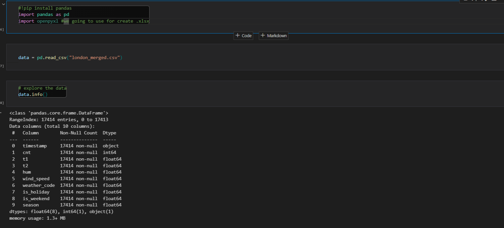
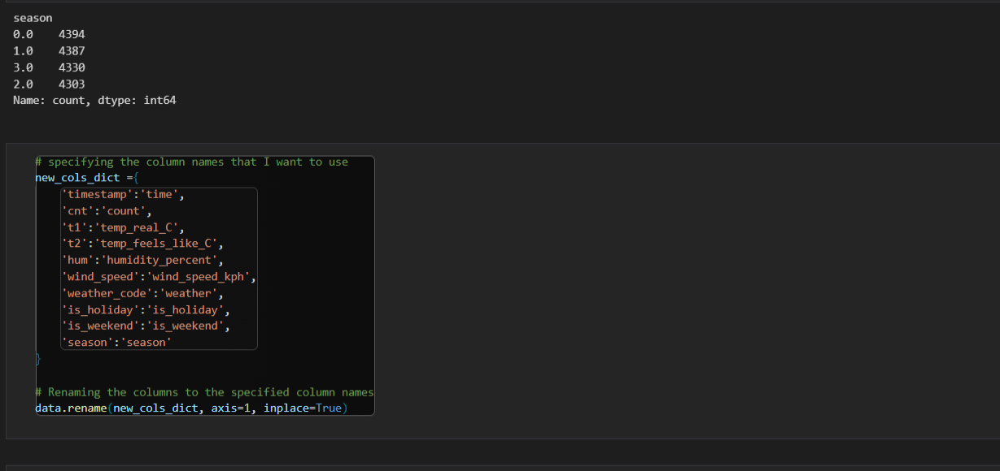
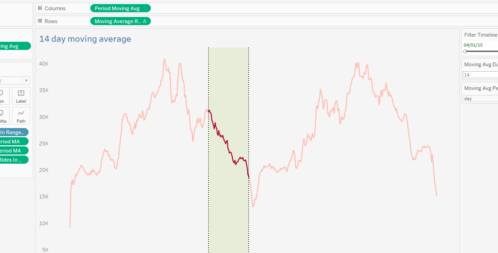
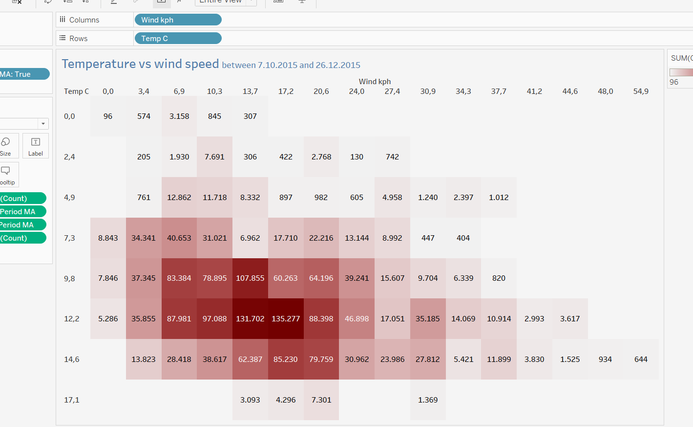
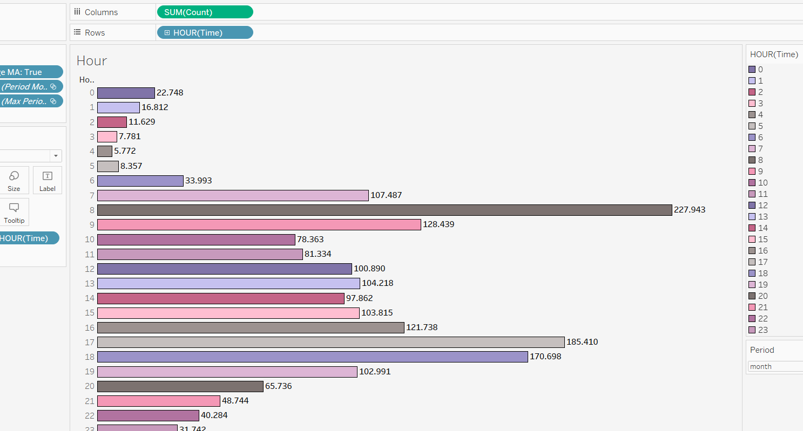
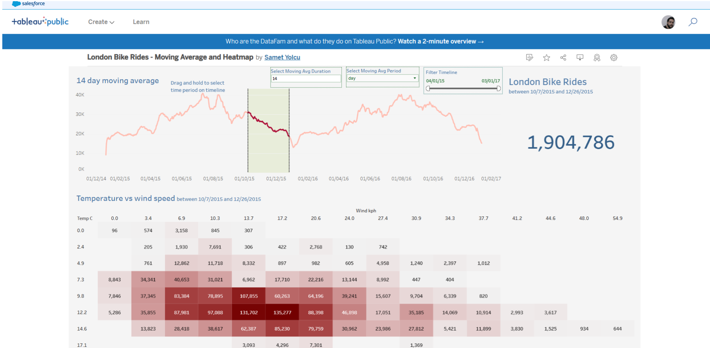

# London Bike Rides Project

Using this data set, we will first start processing with Python and then move on to the data visualization part with Tableau. The aim of our project is to try to predict future bicycle shares.

## Project Creation Stages

In this project, data collection, discovery and processing were primarily done with Python. Then, the dashboard was prepared after creating Average visualization, Total driving visualization, Temperature and wind speed heat map, Weather and hour bar charts in Tableau.

## Libraries

    pandas 
    openpyxl

## Usage

1.Download the project file from GitHub

2.Download the libraries.

    pip install pandas 
    pip install openpyxl

3.Add libraries to your worksheet.

    import pandas as pd
    import openpyxl

## Dataset

You can download the data from Kaggle (https://www.kaggle.com/datasets/hmavrodiev/london-bike-sharing-dataset).

## Website

For more information about the project, visit my website (https://sametyolcu.com/london-bike-rides-project).
